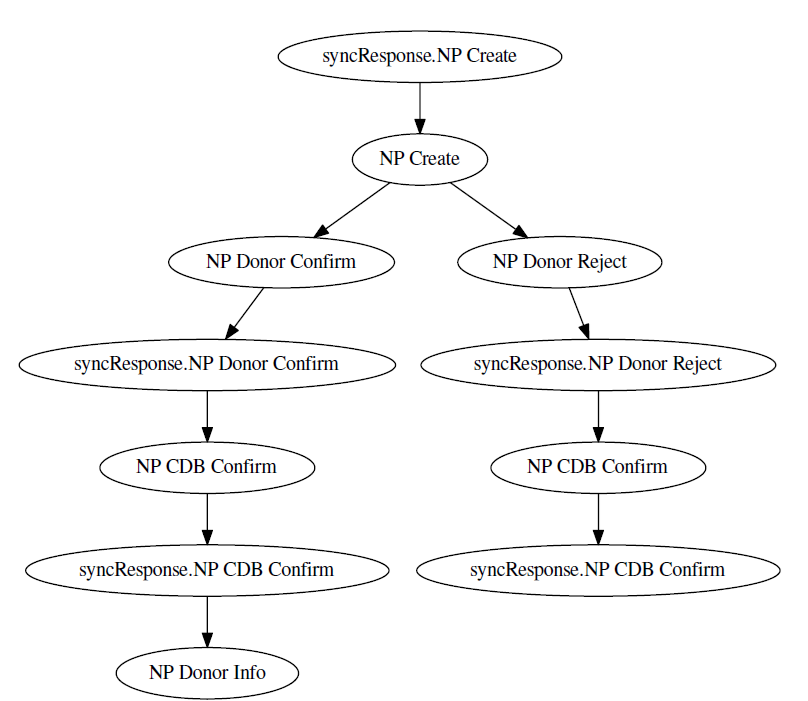

# Model Constructor

Software developed as a supporting asset for MMXXVIII Course Work. Its main purpose is to
extract and visualize model describing contents of the input XML event log. Note that the 
tool is highly specific to the format of the log.

## Runtime Specifics

Note that I've placed `mnp_export.xml` in the `data` folder of the project but not in the
`src/main/scala`, because Java file opening system searches from the project's root.

## Output Example

